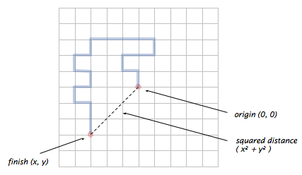

# Arrays and Loops – 50 course points

The purpose of this assignment is to give you extra practice on loops (Random Walker), one and two-dimensional arrays.

Refer to our [Programming Assignments FAQ](https://introcs.cs.rutgers.edu/assignment-faq/) for instructions on how to install VSCode, how to use the command line and how to submit your assignments.

## Programming

Write 2 programs and submit on Autolab. We provide the files [`FindDuplicate.java`](FindDuplicate.java), [`HadamardMatrix.java`](HadamardMatrix.java), and [`RandomWalker.java`](RandomWalker.java). For each problem, update and submit the corresponding file.

Observe the following rules:

-  DO NOT use `if` statements on this assignment
-  DO NOT add any import statements
-  DO NOT add the project statement
-  DO NOT change the class name
-  DO NOT change the headers of ANY of the given methods
-  DO NOT add any new class fields
-  DO NOT use [`System.exit()`](<https://docs.oracle.com/en/java/javase/14/docs/api/java.base/java/lang/System.html#exit(int)>)
-  Observe the examples output, display only what the problem is asking for
-  DO NOT print other messages, follow the examples for each problem.

1. _Two-dimensional random walk_ (20 points). A two-dimensional random walk simulates the behavior of a particle moving in a grid of points. At each step, the random walker moves north, south, east, or west with probability equal to 1/4, independent of previous moves. Write a program `RandomWalker.java` that takes an `int` command-line argument `n` and simulates the motion of a random walk for `n` steps. Print the location at each step (including the starting point), treating the starting point as the origin `(0, 0)`. Also, print the square of the final squared Euclidean distance from the origin as double.

   Note: you do not need arrays for this problem, just keep track of the x and y coordinates during the random walk.

   

   ```sh
   java RandomWalker 20
   (0,0)
   (0,1)
   (-1,1)
   (-1,2)
   (0,2)
   (1,2)
   (1,3)
   (0,3)
   (1,3)
   (2,3)
   (3,3)
   (3,2)
   (4,2)
   (4,1)
   (3,1)
   (3,0)
   (4,0)
   (4,1)
   (3,-1)
   (3,-2)
   (3,-3)
   Squared distance = 18.0
   ```

2. _Find a duplicate_ (10 points). Write a program `FindDuplicate.java` that reads `n` integer arguments from the command line into an integer array of length `n`, where each value is between is `1` and `n`, and displays `true` if there are any duplicate values, `false` otherwise.

   ```sh
   java FindDuplicate 2 10 8 5 4 1 3 6 7 9
   false

   java FindDuplicate 4 5 2 1 2
   true
   ```

3. _Hadamard matrix_ (20 points). The n-by-n Hadamard matrix `H(n)` is a boolean matrix with the remarkable property that any two rows differ in exactly `n/2` values. `H(1)` is a 1-by-1 matrix with the single element `true`, and for `n > 1`, `H(2n)` is obtained by aligning four copies of `H(n)` in a large square, and then inverting all of the values in the lower right n-by-n copy, as shown in the following examples (with `T` representing true and `F` representing false).

   | `H(1)` | `H(2)`     | `H(4)`                                   |
   | ------ | ---------- | ---------------------------------------- |
   | T      | T T<br>T F | T T T T<br>T F T F<br>T T F F<br>T F F T |

   Write a program `HadamardMatrix.java` that takes an `int` command-line argument `n` and prints `H(n)`. Assume that `n` is a power of 2.

   ```sh
   java HadamardMatrix 2
   T T
   T F

   java HadamardMatrix 4
   T T T T
   T F T F
   T T F F
   T F F T
   ```

## Before submission

4. Collaboration policy. Read our collaboration policy [here](https://introcs.cs.rutgers.edu/#academic-integrity).
5. Update `@author`. Update the `@author` tag of the files with your name, email and netid.
6. Submitting the assignment. Submit `FindDuplicate.java`, `HadamardMatrix.java`, and `RandomWalker.java` separately via the web submission system called Autolab. To do this, click the Assignments link from the course website; click the Submit link for that assignment.
