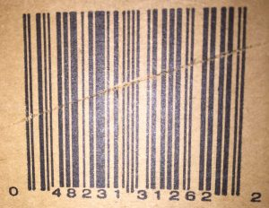
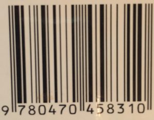

# Pseudocode, test cases, and counting operations – 40 course points

In this assignment you will develop algorithms for problems described below, write test cases that exercise all the possible algorithm execution paths, and calculate the number of operations that are executed in certain algorithmic paths.

## Assignment

For each of the following problems provide:

1. inputs
2. outputs
3. error conditions or pre-conditions
4. an algorithm using the pseudocode reference used in class
5. a set of test cases
6. the minimum number of operations executed in your algorithm
7. the maximum number of operations executed in your algorithm

### Check Digit

Find a UPC bar code somewhere around your house. It will look something like the following:

> UPC-A

> EAN-13

The first image is a UPC-A code (it has 12 digits). The second is an EAN-13 code (it has 13 digits). They both work similarly and we will use the first (UPC-A) code for the first example. You can use either, but make sure to use your symbol, not our to illustrate something about bar codes.

1. Sum every other digit of the code, starting from the right. In the example, that is `2 + 6 + 1 + 1 + 2 + 4 = 16`. Discard the tens digit and keep the ones digit, 6.
2. Start with the second to last digit and do the same thing. Sum the digits, discard the tens digit and keep the ones digit. In this example this is `2 + 2 + 3 + 3 + 8 + 0 = 18`. Discarding the 10 leaves 8. Multiply this number by 3 and again discard the tens digit. `8 * 3 = 24`, leaving 4.
3. Add the numbers from steps 1 and 2. Again drop the tens digit. `6 + 4 = 10`, leaving 0 (zero).

Lets try the same thing for the EAN-13.

> 0 + 3 + 5 + 0 + 4 + 8 + 9 = 29, leaving 9.
>
> 1 + 8 + 4 + 7 + 0 + 7 = 27, leaving 7. 7 \* 3 = 21, leaving 1.
>
> 9 + 1 = 10, leaving 0.

What a coincidence! For both codes, the number we are left with is 0. What number did you get for yours? Was it also 0? If not, check you arithmetic. Both codes work the same way. The last number of the code is a check digit. A computer can quickly check to see if all of the digits of the code are read correctly by the scanner by performing this simple calculation. If the result is 0, it accepts the scan and enters the number. If the result is not 0, the computer will reject the number and give the clerk a warning, usually auditory, to signal that the item needs to be rescanned or the code entered manually.

Write an algorithm that reads a code and displays ACCEPT if after performing the computation described above the result is 0 (zero) or REJECT if the result is not 0 (zero).

Hints:

1. To extract the rightmost digit of a number use: COMPUTE digit AS number MODULUS 10
2. To remove the rightmost digit of a number use: COMPUTE number AS number / 10
3. For full credit use a loop to perform the computation
4. Assume the input value is a positive integer.
