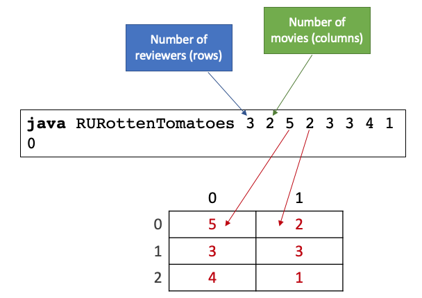

# Arrays and Loops – 50 course points

Refer to our [Programming Assignments FAQ](https://introcs.cs.rutgers.edu/assignment-faq/) for instructions on how to install VSCode, how to use the command line and how to submit your assignments.

## Programming

Observe the following rules:

-  DO NOT use `System.exit()`
-  DO NOT add any `import` statements
-  DO NOT add the project or package statements
-  DO NOT change the class name
-  DO NOT change the headers of ANY of the given methods
-  DO NOT add any new class fields
-  ONLY print the result as specified by the example for each problem.
-  DO NOT print other messages, follow the examples for each problem.

### RU Rotten Tomatoes

Write a program [`RURottenTomatoes.java`](RURottenTomatoes.java) that creates a 2 dimensional integer array of movie ratings from the command line arguments and displays the index of the movie that has the highest sum of ratings. Ratings range from 1 to 5 (inclusive). The rows of the 2D array correspond to movie reviewers and the columns of the 2D array correspond to movies. The reviewer at index 2 gave movie at index 0 a rating of 4. Take a look at the following example for an explanation on the command line arguments sequence.

The first argument corresponds to the number of reviewers and the second argument corresponds to the number of movies (the dimensions of the 2D integer array). Following are the movie ratings in a row-major order. This means that the first row is filled first, then the second row, etc.

In the example above there are 3 reviewers and 2 movies, and the program displays 0 (zero) because the movie at index zero has the highest sum of ratings (movie 0 has sum of ratings equals to 12 while move 1 has sum of ratings equals to 6).

Notes:

1. Assume that the order of the first two input arguments are the number of rows and the number of columns.
2. Assume that there are enough arguments to completely fill the 2D array.
3. If multiple movies have the same highest sum of ratings, display the movie with the lowest index.
