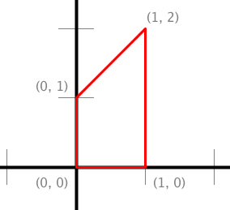
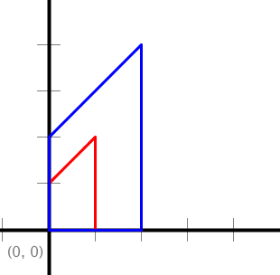
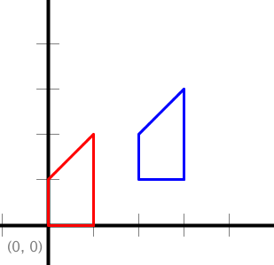
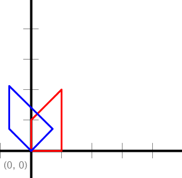
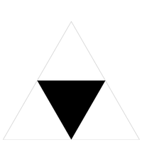
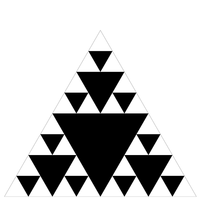
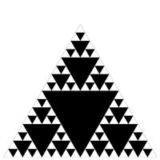
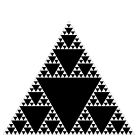
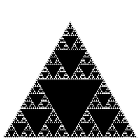

# Functions and Recursion – 55 course points

This assignment consists of two parts. First, write a library of static methods that performs geometric transforms on polygons. Next, write a program that plots a Sierpinski triangle.

Refer to our [Programming Assignments FAQ](https://introcs.cs.rutgers.edu/assignment-faq/) for instructions on how to install VSCode, how to use the command line and how to submit your assignments.

## Programming

Write 2 programs and submit on Autolab. We provide the files `PolygonTransform.java`, and `Sierpinski.java`. For each problem update and submit the corresponding file.

Observe the following rules:
- DO NOT add the project or package statements.
- DO NOT change the class name
- DO NOT change the headers of ANY of the given methods
- DO NOT add any new class fields
- DO NOT use [`System.exit()`](https://docs.oracle.com/en/java/javase/14/docs/api/java.base/java/lang/System.html#exit(int))
- ONLY display the result as specified by the example for each problem.
- DO NOT print other messages, follow the examples for each problem.
- USE `StdIn`, `StdOut`, and `StdDraw` libraries.

1. *Polygon transform* (25 points). Write a library of static methods that performs various geometric transforms on polygons. Mathematically, a polygon is defined by its sequence of vertices `(x_0, y_0)`, `(x_1, y_1)`, `(x_2, y_2)`, ... In Java, we will represent a polygon by storing the x– and y-coordinates of the vertices in two parallel arrays `x[]` and `y[]`.

   

   ```java
   // Represents the polygon with vertices (0, 0), (1, 0), (1, 2), (0, 1).
   double x[] = { 0, 1, 1, 0 };
   double y[] = { 0, 0, 2, 1 };
   ```
   Three useful geometric transforms are scale, translate and rotate.
   - Scale the coordinates of each vertex `(x_i, y_i)` by a factor `α`.
   ```
   x'_i = α x_i
   y'_i = α y_i
   ```
   - Translate each vertex `(x_i, y_i)` by a given offset `(dx, dy)`.
   ```
   x'_i = x_i + dx
   y'_i = y_i + dy
   ```
   - Rotate each vertex `(x_i, y_i)` by `θ` degrees counterclockwise, around the origin.
   ```
   x'_i = x_i cos θ – y_i sin θ
   y'_i = y_i cos θ + x_i sin θ
   ```

   Write a two-dimensional transformation library by implementing the following API:
   ```java
   public class PolygonTransform {
      
      /**
      * Returns a new array object that is an exact copy of the given array.
      * The given array is not mutated.
      * @param array Array to copy
      * @return New array copy
      */
      public static double[] copy(double[] array) {

      }

      /**
      * Scales the polygon by the factor alpha.
      * @param x x-coordinate
      * @param y y-coordinate
      * @param alpha Scale factor
      */
      public static void scale(double[] x, double[] y, double alpha) {

      }

      /**
      * Translates the polygon by (dx, dy).
      * @param x x-coordinate
      * @param y y-coordinate
      * @param dx x offset
      * @param dy y offset
      */
      public static void translate(double[] x, double[] y, double dx, double dy) {

      }

      /**
      * Rotates the polygon theta degrees counterclockwise, about the origin.
      * @param x x-coordinate
      * @param y y-coordinate
      * @param theta Degrees to rotate.
      */
      public static void rotate(double[] x, double[] y, double theta) {

      }

      /**
      * Tests each of the API methods by directly calling them.
      * @param args Command line arguments
      */
      public static void main(String[] args) {

      }
   }
   ```

   Note that the transformation methods `scale()`, `translate()` and `rotate()` mutate the polygons. Here are some example test cases (tests for `copy()` are not shown):

   

   ```java
   // Scales polygon by the factor 2.
   StdDraw.setScale(-5.0, +5.0);
   double[] x     = {0, 1, 1, 0};
   double[] y     = {0, 0, 2, 1};
   double   alpha = 2.0;
   StdDraw.setPenColor(StdDraw.RED);
   StdDraw.polygon(x, y);
   scale(x, y, alpha);
   StdDraw.setPenColor(StdDraw.BLUE);
   StdDraw.polygon(x, y);
   ```

   

   ```java
   // Translates polygon by (2, 1).
   StdDraw.setScale(-5.0, +5.0);
   double[] x  = {0, 1, 1, 0};
   double[] y  = {0, 0, 2, 1};
   double   dx = 2.0, dy = 1.0;
   StdDraw.setPenColor(StdDraw.RED);
   StdDraw.polygon(x, y);
   translate(x, y, dx, dy);
   StdDraw.setPenColor(StdDraw.BLUE);
   StdDraw.polygon(x, y);
   ```

   

   ```java
   // Rotates polygon 45 degrees.
   StdDraw.setScale(-5.0, +5.0);
   double[] x     = {0, 1, 1, 0};
   double[] y     = {0, 0, 2, 1};
   double   theta = 45.0;
   StdDraw.setPenColor(StdDraw.RED);
   StdDraw.polygon(x, y);
   rotate(x, y, theta);
   StdDraw.setPenColor(StdDraw.BLUE);
   StdDraw.polygon(x, y);
   ```

2. *Sierpinski* (30 points). The Sierpinski triangle is an example of a fractal pattern like the H-tree pattern from Section 2.3 of the textbook.

   - Order 1

   

   - Order 2

   

   - Order 3

   

   - Order 4

   

   - Order 5

   

   - Order 6

   

   The Polish mathematician Wacław Sierpiński described the pattern in 1915, but it has appeared in Italian art since the 13th century. Though the Sierpinski triangle looks complex, it can be generated with a short recursive function. Your main task is to write a recursive function `sierpinski()` that plots a Sierpinski triangle of order n to standard drawing. Think recursively: `sierpinski()` should draw one filled equilateral triangle (pointed downwards) and then call itself recursively three times (with an appropriate stopping condition). It should draw 1 filled triangle for `n = 1`; 4 filled triangles for `n = 2`; and 13 filled triangles for `n = 3`; and so forth.

   API specification. When writing your program, exercise modular design by organizing it into four functions, as specified in the following API:

   ```java
   public class Sierpinski {

      /**
      * Height of an equilateral triangle whose sides are of the specified length.
      * @param length Length of side.
      * @return Height of equilateral triangle.
      */
      public static double height(double length) {

      }

      /**
      * Draws a filled equilateral triangle whose bottom vertex is (x, y)
      * of the specified side length.
      * @param x Bottom vertex.
      * @param y Bottom vertex.
      * @param length Length of side.
      */
      public static void filledTriangle(double x, double y, double length) {

      }

      /**
      * Draws a Sierpinski triangle of order n, such that the largest filled
      * triangle has bottom vertex (x, y) and sides of the specified length.
      * @param n Length
      * @param x Bottom vertex.
      * @param y Bottom vertex.
      * @param length Length of side.
      */
      public static void sierpinski(int n, double x, double y, double length) {

      }

      /**
      * Takes an integer command-line argument n;
      * draws the outline of an equilateral triangle (pointed upwards) of length 1;
      * whose bottom-left vertex is (0, 0) and bottom-right vertex is (1, 0); and
      * draws a Sierpinski triangle of order n that fits snugly inside the outline.
      * @param args Command line arguments.
      */
      public static void main(String[] args) {

      }
   }
   ```
   Restrictions: You may not change either the scale or size of the drawing window.

## Before submission
4. Collaboration policy. Read our collaboration policy [here](https://introcs.cs.rutgers.edu/#academic-integrity).
5. Update `@author`. Update the `@author` tag of the files with your name, email and netid.
6. Submitting the assignment. Submit `PolygonTransform.java`, and `Sierpinski.java` separately via the web submission system called Autolab. To do this, click the Assignments link from the course website; click the Submit link for that assignment.

## Getting help

If anything is unclear, don’t hesitate to drop by office hours or post a question on Piazza. Find instructors office hours by clicking the [Staff](https://introcs.cs.rutgers.edu/staff/) link from the course website. You are welcome to ANY professor office hours.

In addition to office hours we have the [CAVE](https://resources.cs.rutgers.edu/docs/rooms-equipment/cave/) (Collaborative Academic Versatile Environment), a community space staffed with lab assistants which are undergraduate students further along the CS major to answer questions.