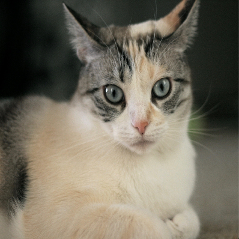
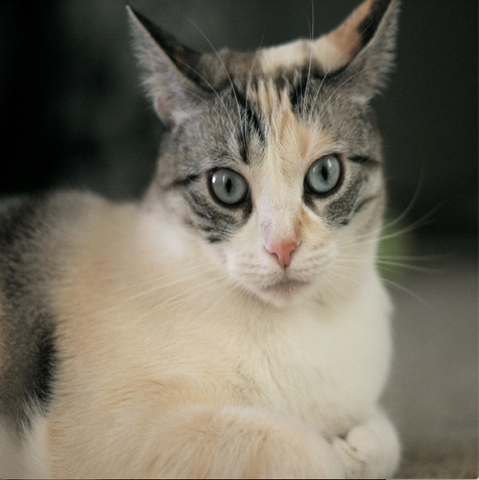
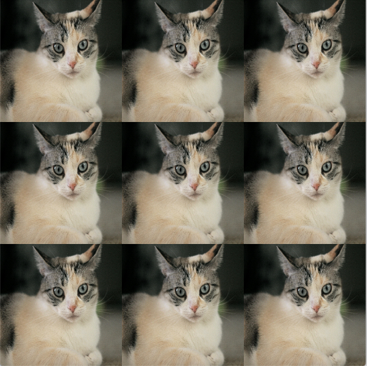
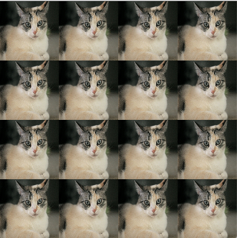
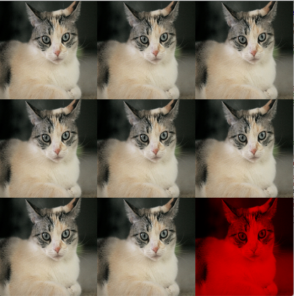
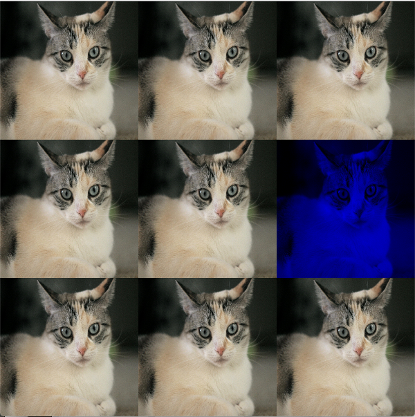
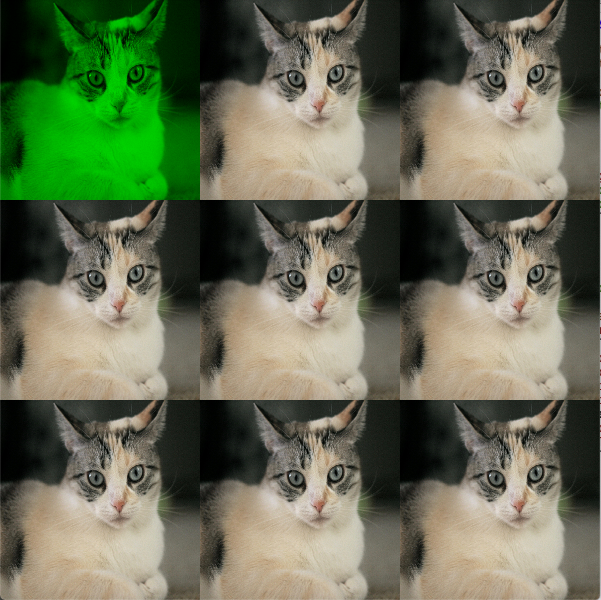
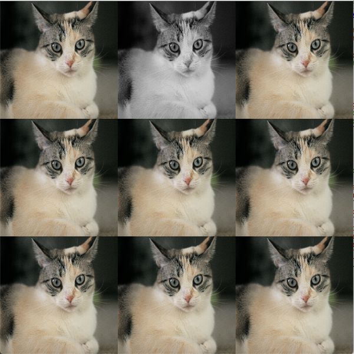
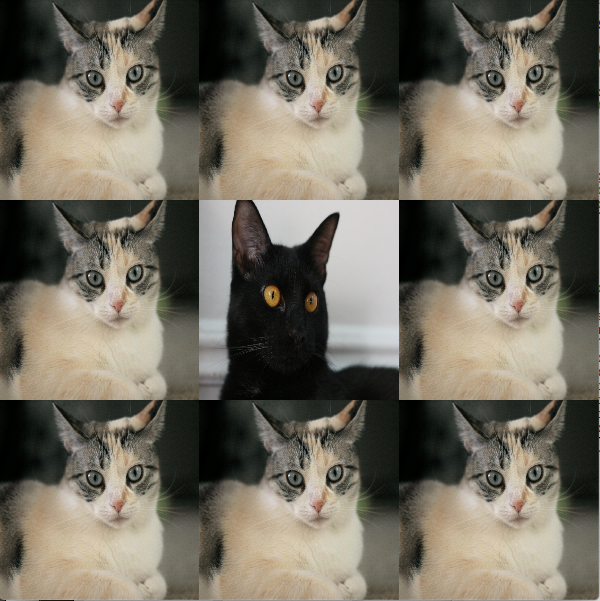
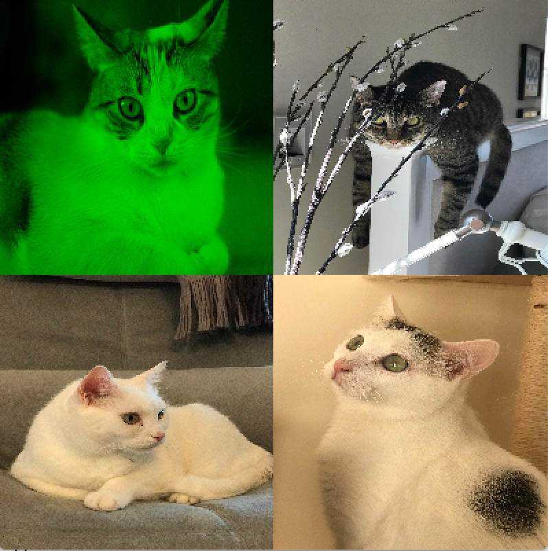

# Project ArtCollage – 100 course points
This assignment consists of creating an abstract data type called ArtCollage, where you will create a collage of images.

Refer to our [Programming Assignments FAQ](https://introcs.cs.rutgers.edu/assignment-faq/) for instructions on how to install VSCode, how to use the command line and how to submit your assignments.

## Programming
Update and submit the file [`ArtCollage.java`]() on Autolab.

Observe the following rules:

- DO NOT use [`System.exit()`](https://docs.oracle.com/en/java/javase/14/docs/api/java.base/java/lang/System.html#exit(int)).
- DO NOT add the project or package statements.
- DO NOT change the class name.
- DO NOT add import statements other than the Color class already in the `ArtCollage.java` file.
- DO NOT change the headers of ANY of the given methods.
- DO NOT add any new class fields.
- ONLY display the result as specified by the example for each problem.
- You may USE any of the libraries provided in the zip file.

1. `ArtCollage` (100 points). The `ArtCollage` class create a collage of image tiles and provides methods to transform the tiles individually. See `ArtCollage.java` for the description of each method.
   
   ### One-argument Constructor
   ```java
   public static void main(String[] args) {
      ArtCollage art = new ArtCollage(args[0]);
      art.showCollagePicture();
   }
   ```

   

   The original image (`args[0]`) has 1536 rows x 1819 columns. The collage resulting from the constructor on the left has 400 rows by 400 columns.

   ### Three-argument Constructor
   ```java
   public static void main(String[] args) {
      ArtCollage art = new ArtCollage(args[0], 200, 3);
      art.showCollagePicture();
   }
   ```

   

   The original image (`args[0]`) has 1536 rows x 1819 columns. The collage resulting from the constructor on the left has 600 rows by 600 columns.

   ### `makeCollage` method
   ```java
   public static void main(String[] args) {
      // Creates a collage of 3x3 tiles. Each tile dimension is 200x200 pixels.
      ArtCollage art = new ArtCollage(args[0], 200, 3);
      art.makeCollage();
      art.showCollagePicture();
   }
   ```

   

   ```java
   public static void main(String[] args) {
      // Creates a default collage of 4x4 tiles. Each default tile dimension is 100x100 pixels.
      ArtCollage art = new ArtCollage(args[0]);
      art.makeCollage();
      art.showCollagePicture();
   }
   ```

   

   ### Change Tile Methods

   ```java
   public static void main(String[] args) {
      // Creates a collage of 3x3 tiles. Each tile dimension is 200x200 pixels
      ArtCollage art = new ArtCollage(args[0], 200, 3);
      art.makeCollage();
      // Colorize tile at col 2, row 2 to only show the red component
      art.colorizeTile("red", 2, 2);
      art.showCollagePicture();
   }
   ```

   

   ```java
   public static void main(String[] args) {
      // Creates a collage of 3x3 tiles. Each tile dimension is 200x200 pixels
      ArtCollage art = new ArtCollage(args[0], 200, 3);
      art.makeCollage();
      // Colorize tile at col 2, row 1 to only show the blue component
      art.colorizeTile("blue", 2, 1);
      art.showCollagePicture();
   }
   ```

   

   ```java
   public static void main(String[] args) {
      // Creates a collage of 3x3 tiles. Each tile dimension is 200x200 pixels
      ArtCollage art = new ArtCollage(args[0], 200, 3);
      art.makeCollage();
      // Colorize tile at col 0, row 0 to only show the green component
      art.colorizeTile("green", 0, 0);
      art.showCollagePicture();
   }
   ```

   

   ```java
   public static void main(String[] args) {
      // Creates a collage of 3x3 tiles. Each tile dimension is 200x200 pixels
      ArtCollage art = new ArtCollage(args[0], 200, 3);
      art.makeCollage();
      // Converts the tile at col 1, row 0 from color to greyscale
      art.greyscaleTile(1, 0);
      art.showCollagePicture();
   }
   ```

   

   ```java
   public static void main(String[] args) {
      // Creates a collage of 3x3 tiles. Each tile dimension is 200x200 pixels
      ArtCollage art = new ArtCollage(args[0], 200, 3);
      art.makeCollage();
      // Replace tile at col 1, row 1 with args[1] image
      art.replaceTile(args[1], 1, 1);
      art.showCollagePicture();
   }
   ```

   

   Note: Make sure to test `colorizeTile()` and `greyscaleTile()` using a collage where each tile has a different image.
   ```java
   public static void main(String[] args) {
      ArtCollage art = new ArtCollage(args[0], 200, 2);
      art.makeCollage();
      // Replace 3 tiles
      art.replaceTile(args[1], 0, 1);
      art.replaceTile(args[2], 1, 0);
      art.replaceTile(args[3], 1, 1);
      art.colorizeTile("green", 0, 0);
      art.showCollagePicture();
   }
   ```

   

## Before submission
2. Collaboration policy. Read our collaboration policy [here](https://introcs.cs.rutgers.edu/#academic-integrity).
3. Update `@author`. Update the `@author` tag of the files with your name, email and netid.
4. Submitting the assignment. Submit `ArtCollage.java` via the web submission system called Autolab. To do this, click the Assignments link from the course website; click the Submit link for that assignment.

## Getting help
If anything is unclear, don’t hesitate to drop by office hours or post a question on Piazza. Find instructors office hours by clicking the Staff  link from the course website.
